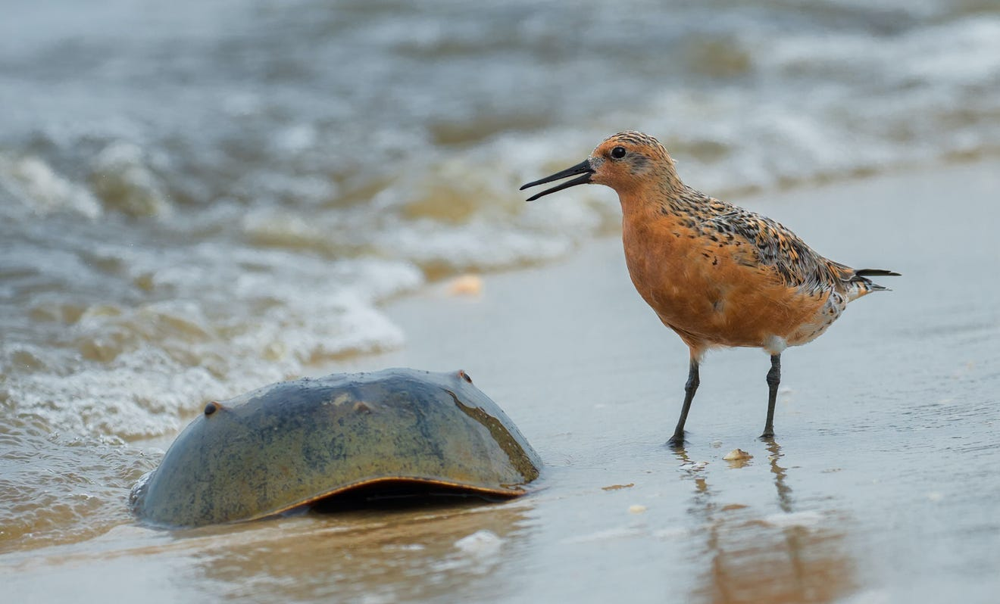
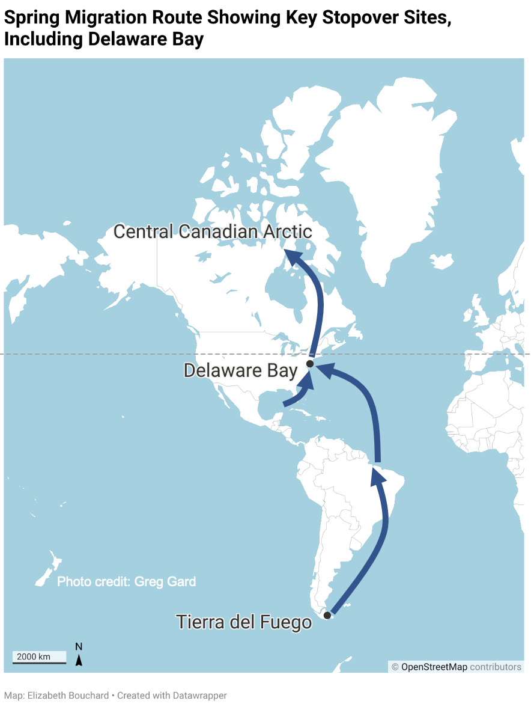
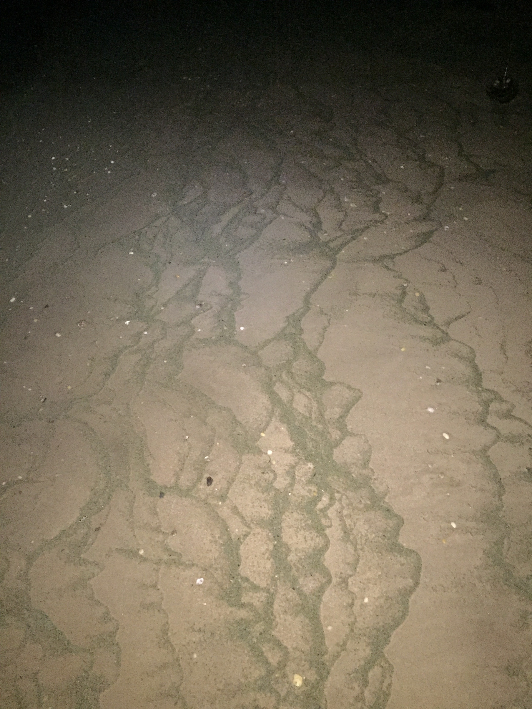
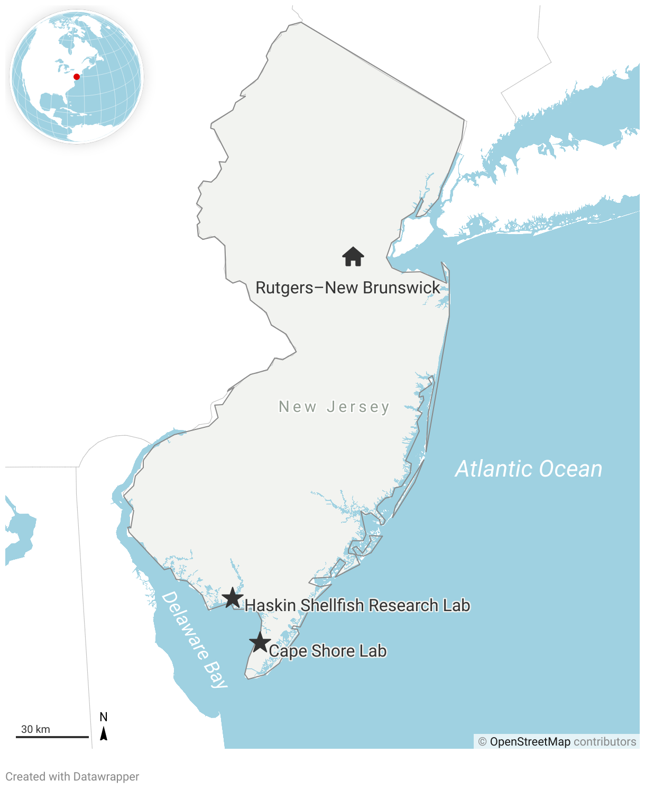
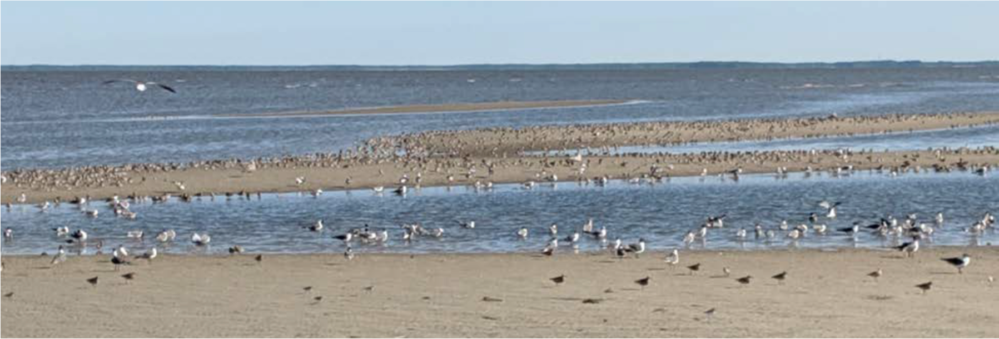
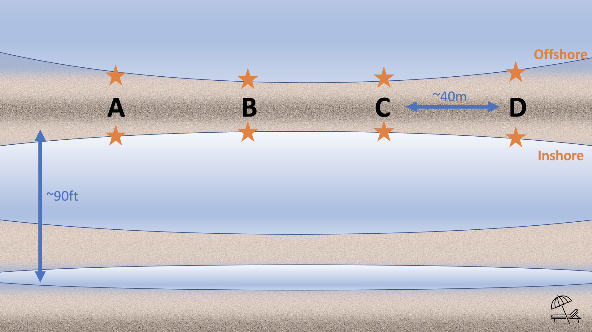
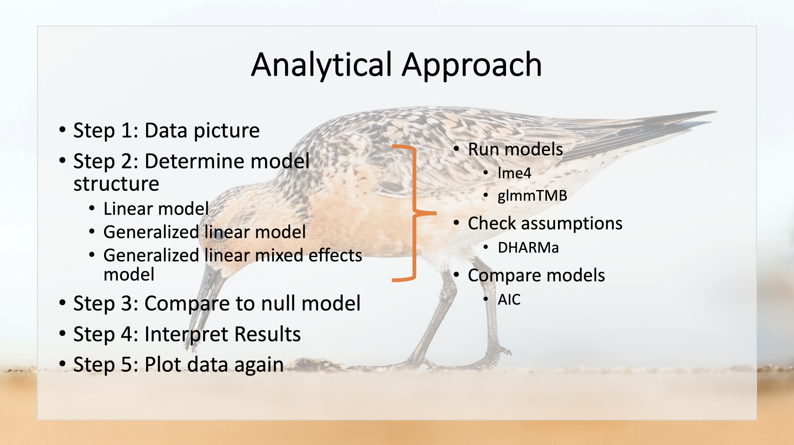

# Introduction

Delaware Bay is renowned for the ecological interaction between spawning horseshoe crabs (*Limulus polyphemus*) and migrating rufa red knots (*Calidris canutus rufa*) (Figure 1). However, climate change is expected to increase timing asynchronies between these two annual cycles. These temporal mismatches have implications for the population persistence of the threatened rufa red knot. In order to inform effective species management efforts in the face of anthropogenic pressure, we must understand the distribution and availability of potential red knot prey items throughout the tidal flats.



The rufa red knot is a robin-sized shorebird that has one of the longest migrations in the entire animal kingdom. These federally threatened birds migrate between their wintering grounds (as far south as Tierra del Fuego, the southernmost tip of South America) and breeding grounds in the central Canadian Arctic (Figure 2). Delaware Bay is the principal stopover habitat for this subspecies, where birds stop to rest and refuel before completing their journey to the Arctic each spring. 



Delaware Bay also hosts the world's largest spawning population of horseshoe crabs, which produce an abundance of eggs along the high tide line (Figure 3). Horseshoe crab eggs are a lipid-rich, easily digestible resource that many species rely on. For 2-3 weeks in May, the rufa red knot stops in Delaware Bay, where they eat massive quantities of horseshoe crab eggs. Declines in horseshoe crab abundance since the 1990s, however, are associated with a rapid decline of red knots, leading to a listing as ‘threatened’ under the US Endangered Species Act in 2015. Although both populations have stabilized following the implementation of horseshoe crab management, climate change is expected to modify this predator-prey interaction by threatening the temporal and spatial synchronicity of red knot and horseshoe crab migrations. In Delaware Bay, the final stopover before birds reach the Arctic, peak spawning and bird migration both typically occur during the third or fourth week of May. Horseshoe crabs migrate to the beaches to spawn in May and June, during which red knots arrive and take advantage of the abundant food resources. If the timing of these events are off, then red knots may not obtain adequate resources to complete their migration to the Arctic. Addressing this potential threat is necessary to understand the factors underpinning this complex ecological interaction, as well as its consequences for population management.




The horseshoe crab-red knot predator-prey relationship has been studied extensively in Delaware Bay since the 1980s. Although the importance of horseshoe crab eggs in the red knot diet has been well established, there has been little to no research on alternative prey resources in Delaware Bay. Red knots are known to eat polychaete worms, clams, and snails in their southern wintering grounds. These types of organisms are also present in Delaware Bay. If alternative prey species are available and abundant in Delaware Bay, red knots may rely more heavily on alternate prey resources when horseshoe crab eggs are scarce. Thus, understanding the distribution and relative abundance of these alternative prey species in Delaware Bay is also critical for anticipating the impacts of climate change on the rufa red knot population. 

My thesis is part of a broader project investigating the distributions of horseshoe crab eggs and foraging rufa red knots in relation to oyster farms in the Cape Shore region of Delaware Bay. Preliminary field sampling was conducted in June 2020 with the goal of informing the planning process for the larger field study, which is set to begin intensive field sampling in 2021. The objectives of this preliminary effort were:

1. To determine sampling methodology (i.e. how to sample and where to sample),
2. To get a sense of what macroinvertebrate organisms are in the sediment, and 
3. To improve our understanding of the distribution of horseshoe crab eggs and other potential red knot prey resources in the tidal flats.

The analysis presented in this report focuses on a narrow question using a subset of the preliminary data. For this final paper, I assessed the distribution of prey resources in relation to sandbars. **The specific research question targeted in this analysis is: Are there differences in prey abundance on the inshore and offshore sides of the sandbar?** This question is important because it provides baseline information about the red knot prey distribution, which has implications for where we might expect to find red knots foraging. It also provides information that will inform our sampling design. For example, if egg abundances are different on the inshore vs. the offshore side of the sandbar, then we may need to collect samples on both sides. However, if there is no difference, then perhaps we can collect fewer samples and focus our sampling efforts one side or the other.

# Methods

## Study Area

The fieldwork associated with this project was conducted at Rutgers Cape Shore Research Laboratory (CSL; Figure 4), which is located about 2 hours south of New Brunswick, New Jersey. This facility is situated in the Cape Shore region of Delaware Bay and provides the opportunity to observe the remarkable ecological phenomenon between horseshoe crabs and rufa red knots. Horseshoe crabs typically lay nests on the beaches in this region between April and June. Rufa red knot use this region as a stopover site during their northward migration, typically visiting for two to three weeks in May. The study area is characterized by tidal flats with sandbars and sloughs, the water-filled areas between sandbars at low tide.



## Field Sampling

Sediment core samples were collected in the tidal flats at the CSL on June 2, 2020. Sediment core samples were 6.5 cm in diameter by 5cm in height. 
 The preliminary sampling effort was focused on the second sandbar, which was about 90ft from the high tide line (Figure 5). Sediment core samples were collected at four sites along the sandbar: A, B, C, and D (Figure 6). They were each spaced out by ~40m. At each of these four sites, one sediment core sample was collected on both the inshore and offshore sides of the sandbar every 15 minutes as the tide went out. The inshore and offshore sampling points are indicated by the orange stars. Samples were captured at six time points, for a total of 48 sediment cores. Samples were frozen at Rutgers Haskin Shellfish Research Laboratory prior to analysis.
 
 




## Laboratory Processing

Samples were thawed and rinsed through sediment sieves in order to sort particles into three size classes: 2mm, 1mm, and 0.5mm. For each sample, the contents of each sieve were transferred to separate petri dishes. These samples were examined under the dissecting microscope. All organisms were identified and the number of individual organisms per prey type was counted in each sample.

## Data Analysis Overview

I decided to use three variables for this analysis: sandbar site, the side of the sandbar, and abundance. In order to account for many zero counts in the dataset, I combined the abundance data for horseshoe crab eggs, worms, clams, and gastropods into one variable called prey abundance, assuming that these organisms are likely prey resources for rufa red knot. Note that the variables and prey types have different names in the R code and my report. In the R code, I refer to the sandbar site as "Point_on_Sandbar", the side of the sandbar as "Inshore_or_Offshore", and abundance as "Abundance" or "TotAbundance." In the code, I refer to snails as "Gastropod", worms as "Annelid", and horseshoe crab eggs as "HSC_eggs."

To approach this analysis, I started by tidying the data. Then, I plotted the data. Next, I determined the appropriate model structure by running various models and checking diagnostics. To run the models, I used the lme4 and glmmTMB packages and I checked assumptions primarily using the DHARMa package. Next, I compared my alternative model to the null model, interpreted the results, and finally plotted the fitted model onto the data.




# Results

## Tidying Data

First, I load the necessary libraries.
```{r setup}
library(tidyverse)
# tidyverse automatically loads all the packages below
library(readr)  
library(tidyr) 
library(forcats) 
library(dplyr)  
library(ggplot2)  
library(stringr) 

library(ggfortify) # for autoplot
library(lme4)
library(lmerTest)

require(glmmTMB) # for glmms
require(DHARMa) # for glm model evaluation
```

Then, I import the complete dataset.
```{r data prep}
sandbar <- read_csv("Final_Project_AEDA/Prelim_Data_Sandbar.csv") 
```

Now look at the data.
```{r Look at the data}
glimpse(sandbar)
summary(sandbar)
```

Next, I need to manipulate the data to make columns for the total number of gastropods and clams for each subsample. Right now we have separate columns for: "Gastropod", "Empty_gastropod", "Clam" and "Single_clam_valve". "Gastropod" means that the snail shell contained tissues at the time of sample processing and "Empty_gastropod" means that the snail did not contain tissues. We assume that all snails were alive at the time the sample was collected and that sieving the sample and flushing it with water removed the tissues. We assume the same for "Clam" and "Single_clam_valve," the second of which was a single disarticulated clam valve. First, we have to make a row-wise data frame because, although dyplyr is good at performing operations over columns, it's much more tricky over rows.
```{r Make row-wise data frame}
sandbar <- sandbar %>% rowwise(Subsample_ID)
```

The next step is to make a "Gastropod" column that is the sum of "Gastropod" and "Empty_gastropod" columns. This will estimate the number of gastropods that were in the sample upon collection. We are assuming that all gastropods (whether or not they contain tissues) were alive at the time of sample collection.
```{r Make new column for total gastropods}
summary(sandbar)
sandbar <- mutate(sandbar, Gastropods = sum(c(Gastropod, Empty_gastropod)))
```


Then, we repeat the above step for the "Ostracod" and "Empty_ostracod" columns.
```{r Make a single ostracod column}
sandbar <- mutate(sandbar, Ostracods = sum(c(Ostracod, Empty_ostracod)))
```

We make a "Clam" column that is the sum of current "Clam", "Empty_oyster", and half of "Single_clam_valve". This column will estimate the number of clams that were in the sample upon collection. We are assuming all single full valves that we found during processing were live clams at the time of sample collection.
First, we divide "Single_clam_valve" by 2 in order to estimate the numbers of single valves that might have been full clams at the time of sample collection.
```{r Make a single clam column}
sandbar <- mutate(sandbar, Single_clam_valve = (Single_clam_valve/2))
sandbar <- mutate(sandbar, Clams = sum(c(Clam, Empty_oyster, Single_clam_valve)))
sandbar <- mutate(sandbar, Clams = ceiling(Clams)) #Round up everything that ends with .5 to the nearest integer (whole number). This helps with AIC.
```

Now we are ready to prepare and tidy the data. I start by getting rid of columns of duplicate raw data ("Gastropod", "Empty_gastropod", "Clam", "Single_clam_valve", "Empty_oyster", "Ostracod", "Empty_ostracod") and notes to prevent confusion.
```{r Make new dataframe by removing columns from dataset}
tidysandbar <- select(sandbar, -Clam, -Gastropod, -Single_clam_valve, -Empty_gastropod, -Empty_oyster, -Ostracod, -Empty_ostracod, -Notes, -Notes_during_Collection, -Notes_during_Processing)
tidysandbar <- gather(tidysandbar, Taxa, Abundance, c(12:24))
```

Next, I check the variable types using glimpse(), change the appropriate variables to factors, and check my work.
```{r fix variable types}
glimpse(tidysandbar)
tidysandbar <- mutate(tidysandbar, Point_on_Sandbar=factor(Point_on_Sandbar))
tidysandbar <- mutate(tidysandbar, Inshore_or_Offshore=factor(Inshore_or_Offshore))
tidysandbar <- mutate(tidysandbar, Time_Point=factor(Time_Point))
tidysandbar <- mutate(tidysandbar, Size_Class=factor(Size_Class))
tidysandbar <- mutate(tidysandbar, Sample_ID=factor(Sample_ID))
tidysandbar <- mutate(tidysandbar, Subsample_ID=factor(Subsample_ID))
tidysandbar <- mutate(tidysandbar, Taxa=factor(Taxa))
#check my work
glimpse(tidysandbar)
summary(tidysandbar)
```

I need to fix the time variable. Right now I have two time columns. Time_Point is categorical and Time is the time that the sample was collected in the field. I want to create a new column in the dataframe with a time variable (Time_simple) that standardizes time (i.e. 0 min, 15 min, 30 min, and so on) as a numeric variable.
```{r New time variable}
tidysandbar <- mutate(tidysandbar, Time_simple = Time_Point)
levels(tidysandbar$Time_simple)[levels(tidysandbar$Time_simple)=="T1"] <- "0"
levels(tidysandbar$Time_simple)[levels(tidysandbar$Time_simple)=="T2"] <- "15"
levels(tidysandbar$Time_simple)[levels(tidysandbar$Time_simple)=="T3"] <- "30"
levels(tidysandbar$Time_simple)[levels(tidysandbar$Time_simple)=="T4"] <- "45"
levels(tidysandbar$Time_simple)[levels(tidysandbar$Time_simple)=="T5"] <- "60"
levels(tidysandbar$Time_simple)[levels(tidysandbar$Time_simple)=="T6"] <- "75"
glimpse(tidysandbar) #Time_simple is currently a factor. We want to make it time.
tidysandbar <- mutate(tidysandbar, Time_simple=as.numeric(as.character(Time_simple))) #Make Time_simple numeric to represent the number of minutes since tide.
glimpse(tidysandbar) #Check my work. It worked!
```

Now I need to exclude the taxa from the dataset that will not be used in this analysis. I will do so by checking levels of Taxa and then filtering out the unnecessary taxa and making a new dataframe. These unnecessary taxa (or groups of organisms) include: Exoskeleton, Unknown, and Unknown Star Organism. I will exclude nematodes as well because we did not count them for all samples and they are unlikely food resource for red knots. I excluded the <0.25 mm and 0.25 mm size classes because we did not process them for all samples. Lastly, I removed the extra samples because they are not part of this sampling design and they are unique: they have no replicates.
```{r remove data that will not be used in this analysis}
levels(tidysandbar$Taxa)
tidiersandbar <- filter(tidysandbar, Taxa != "Exoskeleton" & Taxa != "Unknown" & Taxa != "Unknown Star Organism")
tidiersandbar <- filter(tidysandbar, Taxa != "Nematode" & Taxa != "Exoskeleton" & Taxa != "Unknown" & Taxa != "Unknown Star Organism")
tidiersandbar <- filter(tidiersandbar, Size_Class != "<0.25" & Size_Class != "0.25")
tidiersandbar <- tidiersandbar %>%
    filter(!str_detect(Inshore_or_Offshore, "Extra")) 
#Check data again
glimpse(tidiersandbar)
summary(tidiersandbar)
```

Based on my understanding of the literature, I think that the most likely prey resources for rufa red knot in Delaware Bay are: horseshoe crab eggs, clams, gastropods, and annelids. For my analysis, I am going to exclude all of the other taxa and organize these potential prey items into a single group called "Prey."
```{R organize prey into a single variable}
sandbar_prey <- tidiersandbar[(tidiersandbar$Taxa=="HSC_egg") | (tidiersandbar$Taxa=="Annelid") | (tidiersandbar$Taxa=="Clams") 
                              | (tidiersandbar$Taxa=="Gastropods"),]
```

Next, I explore the data. Of the four types of prey items considered in the analysis, annelids are most abundance (233), followed by clams (170), horseshoe crab eggs (90), and gastropods (23).

```{r data exploration}
sandbar_prey %>%
    group_by(Taxa) %>%
    summarize(TotAbundance = sum(Abundance))
```

Finally, I made the dataframe to be used in our analysis by removing size class. When size class is included in the dataset, each row is a subsample. By removing this column from the dataset, each row is now a single sample.
```{r remove size class}
simplesand <-  sandbar_prey %>%
    group_by(Point_on_Sandbar, Inshore_or_Offshore, Time_simple) %>%
    summarize(TotAbundance = sum(Abundance))
```


## Data Picture

Reminder: What variables am I working with?
```{r }
summary(simplesand)
```

This is the preliminary boxplot of my data. The blue points are the data points. As you can see, it looks like prey abundance may be greater on the inshore side of the sandbar. The Median abundance on the inshore side is high (14.5) compared to offshore side (5) of sandbar. I also noticed that there is greater spread on the inshore side of the sandbar, suggesting that prey availability may be more variable on the inshore side. 

```{r ggplot}
ggplot(simplesand, aes(x=Inshore_or_Offshore, y=TotAbundance))+
    geom_boxplot(outlier.shape = NA) +
    geom_jitter(alpha=0.5,color = "skyblue2",size=3) +
    theme_bw() +
    ggtitle('Abundance of Potential Red Knot Prey Items on \n the Inshore and Offshore Side of Sandbars') +
    xlab("Side of Sandbar") + 
    ylab("Prey Abundance") +
    theme(plot.title = element_text(color="black", size=16, face="bold.italic", hjust = 0.5),
          axis.title.x = element_text(color="black", size=14, face="bold", margin = margin(t = 10, r = 0, b = 0, l = 0)),
          axis.title.y = element_text(color="black", size=14, face="bold", margin = margin(t = 0, r = 10, b = 0, l = 0)),
          axis.text.x = element_text(color="black", size=12),
          axis.text.y = element_text(color="black", size=12),
          panel.background = element_rect(fill = "white"),
          panel.grid.major = element_blank(),
          panel.grid.minor = element_blank(),
          plot.background = element_rect(fill = "azure")) +
    scale_y_continuous(breaks=seq(0,55,5))
```

I also calculate the center of the distributions, as referenced in the above distribution of the figure.
```{r Calculate center of distributions}
In <- subset(simplesand, Inshore_or_Offshore == "Inshore")
median(In$TotAbundance) #14.5
mean(In$TotAbundance) #16.75
Off <- subset(simplesand, Inshore_or_Offshore == "Offshore")
median(Off$TotAbundance) #5
mean(Off$TotAbundance) #5.4166667
```

Next, I visualize the data in another way. I look at a histogram to examine the distribution of prey abundance on the inshore and offshore sides of the sandbar separately. They confirm the above findings.
```{r histograms}
In <- subset(simplesand, Inshore_or_Offshore == "Inshore")
hist(In$TotAbundance,breaks=seq(0,60,1))
Off <- subset(simplesand, Inshore_or_Offshore == "Offshore")
hist(Off$TotAbundance,breaks=seq(0,60,1))
```

## Determine Model Structure

The next step is to determine the appropriate model structure. I tested model structure in the following order:

- Linear model
- Generalized linear model with poisson distribution
- Generalized linear mixed effects model with poisson distribution
- Generalized linear mixed effects model with negative binomial distribution

First, I run a linear regression model with prey abundance modeled as a function of sandbar side. As a reminder, sandbar side refers to the inshore vs. offshore side of the sandbar. Then, I check the diagnostics using autoplot and look at a histogram of the residuals.
```{r linear model and diagnostics}
bar_mod <- lm(TotAbundance ~ Inshore_or_Offshore, data = simplesand)
hist(bar_mod$residuals) 
autoplot(bar_mod) 
```
This data does not meet the assumptions of a linear model. Looking at the diagnostics with autoplot you see that the data does not meet the assumptions of a linear model. For example, the qq plot shows that the residuals are not normally distributed. Instead, they are right-skewed as shown by the histogram. 

Here is my interpretation of the autoplot output:

- Residuals vs. Fitted: This checks the assumption that a line is an appropriate fit for our data. There is no clear pattern in the residuals, but there is much greater scatter at right, suggesting that a line is not appropriate.
- Normal Q-Q: This plot indicates that the assumption that residuals are normally distributed is not met. The plot indicates that the residuals are skewed to the right.
- Scale-Location: This plot suggests that the data violates the assumption that variance is similar across the range of X values. There is evidence of heteroscedasticity because the variance of residuals is greater at the right side of the plot.
- Residuals vs. Leverage: There may be some influential data points on the inshore side of the sandbar.

Next, I look at the distribution of the abundance data to get a sense of what error distribution might be most appropriate.
```{r look at distribution of abundance data}
hist(simplesand$TotAbundance,breaks=seq(0,55,1),main="Histogram of Prey Abundance", xlab = "Prey Abundance")
mean(simplesand$TotAbundance) #11.08333
max(simplesand$TotAbundance)
min(simplesand$TotAbundance) #2
```
I decide that a Poisson distribution might be a better choice because 1) we are working with count data, 2) it peaks near zero, and 3) it is right skewed. It has a relatively low mean of about 11 prey items.

Next, I run a generalized linear model with side of sandbar as the predictor and I use a poisson distribution. I check the diagnostics plots with autoplot() again.
```{r run glm}
bar_glm1 <- glm(TotAbundance ~ Inshore_or_Offshore, data = simplesand, family = poisson)
autoplot(bar_glm1)
```
The autoplot diagnostics results do not look better than those of the linear model, suggesting that this model violates the model assumptions.

To be thorough and consistent with the following models, I also check the diagnostics of the GLM using the DHARMa package.
```{r Check diagnostics using DHARMa}
res_glmbar1 <- simulateResiduals(fittedModel = bar_glm1, plot = F)
plot(res_glmbar1)
testDispersion(res_glmbar1)
```
For the DHARMa residual diagnostics, the lefthand plot is a qq-plot that detects deviations from the expected distribution. Ideally, the black dots will line up with the red line. The righthand figure plots residuals against the predicted values.

The lefthand QQ plots for our model shows there is high overdispersion, which means that the data is more variable than the distribution of the model. 
Also, the DHARMa nonparametric dispersion test yields a dispersion value of 6.1 with a p-value of less than 2.2e-16. This value is the ratio of the observed versus the mean simulated variance, and since we have a significant ratio greater than 1, we have evidence of overdispersion.

To account for overdispersion, I add sandbar site to the model as a random intercept. I decide to use site as a random effect because multiple samples were collected from each of four locations on the sandbar, so I expect these samples might be more similar in prey abundance. Now we are working with a generalized linear mixed effects model with a poisson distribution.
```{r run GLMM}
bar_glm2 <- glmer(TotAbundance ~ Inshore_or_Offshore + (1|Point_on_Sandbar), data = simplesand, family = poisson) #random intercept model
summary(bar_glm2)
res_glmbar2 <- simulateResiduals(fittedModel = bar_glm2, plot = F)
plot(res_glmbar2)
testDispersion(res_glmbar2)
```

As shown in the DHARMa residual diagnostics, this model is an improvement from the generalized linear model, but there is still evidence of overdispersion. In addition to the QQ plot, the DHARMa nonparametric dispersion test yields a dispersion value of 3.3 with a p-value of less than 2.2e-16, indicating overdispersion.

Next, I address the overdispersion problem by using the negative binomial distribution instead of poisson. I fit a generalized linear mixed effects model with a negative binomial distribution. Again, abundance was the response variable, the side of the sandbar was the explanatory variable, and sandbar site was a random intercept.
```{r GLMM with negative binomial}
bar_glm3 <- glmmTMB(TotAbundance ~ Inshore_or_Offshore + (1|Point_on_Sandbar), data = simplesand, family = nbinom1)
summary(bar_glm3)
res_glmbar3 <- simulateResiduals(fittedModel = bar_glm3, plot = T)
plot(res_glmbar3)
testDispersion(res_glmbar3) 
```
As shown by the DHARMa residual diagnostics plots, this model does not exhibit overdispersion. The residuals line up well with the red line of the expected distribution in the lefthand qqplot. This is confirmed by the DHARMa nonparametric dispersion test which yields a dispersion value of 1.67 and a p-value of 0.104. The righthand figure shows that there are no simulation outliers. Also, the empirical quantiles (solid lines) and theoretical quantiles (dashed lines) appear reasonably similar, suggesting that the expected quantiles do not significantly deviate. 


I also check for zero-inflation (testZeroInflation). Zero-inflation is a type of overdispersion in which there are more zeros in your observed data than expected under the fitted model. First, I check for zero-inflation by using DHARMa. This test compares the observed versus the expected number of zeros. Another way to check for zero-inflation is to fit a model with zero-inflation and compare it to the model without zero-inflation. I did this as well.
```{r zero-inflation test}
testZeroInflation(res_glmbar3)
zeromod2 <- glmmTMB(TotAbundance ~ Inshore_or_Offshore + (1|Point_on_Sandbar), ziformula = ~1, data = simplesand, family = nbinom1)
summary(zeromod2)
simulationz <- simulateResiduals(fittedModel = zeromod2)
plot(simulationz)
#compare AIC for models with and without zero-inflation
AIC(bar_glm3,zeromod2) 
```

There is no evidence of zero-inflation. For the zero-inflation test, we get a value of 0 and a p-value of 0.52, which indicates that the observed data has less zeros than expected. In other words, we do not have evidence of zero-inflation. A comparison of the models with and without zero-inflation shows that they receive similar support, as the deltaAIC is 2. However, the model without zero-inflation is the better model. Also, it is worthwhile to not that my data has no zeros because I added all four prey taxa together.

Next, I check for heteroscedasticity. I plot the standardized residuals against the fitted values. It looks decent because the variance is relatively consistent across the x-axis. I also plot the standardized residuals against the predictor variable, which confirms that there is similar spread in the residuals for inshore vs. offshore.
```{r Heteroscedasticity check}
res_bar_glm3 <- residuals(bar_glm3, type='pearson')
plot(res_bar_glm3~fitted(bar_glm3),main="Standardized Residuals vs. Fitted for GLMM", xlab = "Fitted", ylab = "Standardized Residuals")
plot(res_bar_glm3~simplesand$Inshore_or_Offshore,main="Standardized Residuals vs. Predictor for GLMM", xlab = "Predictor", ylab = "Standardized Residuals")
```

**After performing these diagnostics tests, I decided that this model structure better fits the data and I decided to use the GLMM with the negative binomial family for model selection.**

## Compare to Null Model

The next step is to fit the corresponding null model. I choose the null model because I am asking the question: **Are there differences in prey abundance on the inshore vs. offshore side of sandbars?** Then, I compared the models using AIC. The deltaAIC is greater than 10, thus providing substantially more evidence in support of the alternative model (AIC 304) than the null model (AIC 328). I decide to use the generalized linear mixed effects model with a negative binomial distribution and with abundance as the response variable, the side of the sandbar as the explanatory variable, and sandbar site as a random intercept.
```{r fit null model and compare to alternative}
bar_glm5 <- glmmTMB(TotAbundance ~ 1 + (1|Point_on_Sandbar), data = simplesand, family = nbinom1)
summary(bar_glm5)
res_glmbar5 <- simulateResiduals(fittedModel = bar_glm5, plot = T)
plot(res_glmbar5)
testDispersion(res_glmbar5)
#Compare models.
AIC(bar_glm3,bar_glm5)
```

## Interpret Results

Finally, I interpret the selected model.
```{r interpret model}
summary(bar_glm3)
exp(-1.0019) #0.3671811
```
This model indicates that the side of the sandbar has a strong effect on prey abundance with a p-value less than 0.001. The slope for the side of the sandbar is -1.0019 (on the log scale), indicating that the natural log of prey abundance for the offshore side is on average 1.0019 less than that of the inshore side. When I account for the log link, the slope of the model is 0.3671811, indicating that prey abundance for the offshore side of the sandbar is on average a factor of about 0.37 times less than the prey abundance on the inshore side of the sandbar.

The random intercept is normally distributed with mean 0 and variance 0.02543. In other words, different sites have different prey abundances.

This finding matches our expectations based on our initial data pictures.

## Plot Data Again

Lastly, I plot the model prediction (shown by the orange triangles) back onto the data with confidence intervals for the fitted value of y (shown by the orange lines). The blue circles indicate the original data points. 
```{r plot model onto data}
newdat2 <- expand.grid(Inshore_or_Offshore=c("Inshore","Offshore"))
#design matrix (fixed effects)
mm2 <- model.matrix(delete.response(terms(bar_glm3)),newdat2)
#Linear predictor, back-transform this with the inverse link function
newdat2$TotAbundance <- drop(mm2 %*% fixef(bar_glm3)[["cond"]])
predvar2 <- diag(mm2 %*% vcov(bar_glm3)[["cond"]] %*% t(mm2))
newdat2$SE <- sqrt(predvar2)
newdat_transform2 <- mutate(newdat2, ci_lwr = TotAbundance - (1.96 * SE), ci_upr = TotAbundance + (1.96 * SE))
newdat_transform2 <- mutate(newdat_transform2, TotAbundance = exp(TotAbundance), ci_lwr = exp(ci_lwr), ci_upr = exp(ci_upr))
#plot
pd <- position_dodge(width = 0.4)
g3 <- ggplot(simplesand, aes(x=Inshore_or_Offshore, y=TotAbundance))+
     geom_boxplot(outlier.shape = NA) + #hides outliers
    geom_jitter(alpha=0.5,color = "skyblue2",size=3)
g4 <- g3 +
    geom_point(data=newdat_transform2, shape=17, size=5, position=pd, color="darkorange2") 
#confidence intervals
g5 <- g4 + 
    geom_linerange(data=newdat_transform2, aes(ymin=ci_lwr, ymax=ci_upr),
                  lwd=3, position=pd, color = "darkorange1", alpha = 0.4) + #alpha controls opacity
    theme_bw() +
    ggtitle('Model Predictions with Confidence Intervals Plotted on the Original Data') +
    xlab("Side of Sandbar") + 
    ylab("Prey Abundance") +
    theme(plot.title = element_text(color="black", size=16, face="bold.italic", hjust = 0.5),
          axis.title.x = element_text(color="black", size=14, face="bold", margin = margin(t = 10, r = 0, b = 0, l = 0)),
          axis.title.y = element_text(color="black", size=14, face="bold", margin = margin(t = 0, r = 10, b = 0, l = 0)),
          panel.background = element_rect(fill = "white"),
          axis.text.x = element_text(color="black", size=12),
          axis.text.y = element_text(color="black", size=12),
          # panel.border = element_blank(),
          panel.grid.major = element_blank(),
          panel.grid.minor = element_blank(),
          plot.background = element_rect(fill = "azure")) +
    scale_y_continuous(breaks=seq(0,55,5))
g5
```
As you can see, the model lines up quite well with what I would expect given the original data picture. I conclude that the side of the sandbar influences prey abundance.

But I have one further question: **Is this trend driven by any particular type of prey?**

To address this question, I plot the abundance of the four prey types (worms, clams, snails, and horseshoe crab eggs) against the inshore vs. offshore side of the sandbar. Based on this visual assessment, the trend appears to be driven by annelids, clams, and HSC eggs, which are more abundant on the inshore side of the sandbar. However, there are more snails on average on the offshore side of the sandbar. 
```{r ggplot prey types}
sandbar_prey %>% group_by(Point_on_Sandbar, Inshore_or_Offshore, Time_simple, Taxa) %>%
    summarize(TotAbundance = sum(Abundance)) %>%
    ggplot(data=, aes(x = Inshore_or_Offshore, y = TotAbundance, color=Taxa)) +
    geom_boxplot(outlier.shape = NA) +
    geom_point(alpha = 0.2, position = position_jitterdodge(jitter.width = 1)) +
    theme_bw() +
    ggtitle('Abundance of Potential Red Knot Prey Items on \n the Inshore and Offshore Side of Sandbars') +
    xlab("Side of Sandbar") + 
    ylab("Prey Abundance") +
    scale_color_discrete(name="Prey Type", labels = c("Worms", "Clams", "Snails", "HSC Eggs")) +
    theme(plot.title = element_text(color="black", size=16, face="bold.italic", hjust = 0.5),
          axis.title.x = element_text(color="black", size=14, face="bold", margin = margin(t = 10, r = 0, b = 0, l = 0)),
          axis.title.y = element_text(color="black", size=14, face="bold", margin = margin(t = 0, r = 10, b = 0, l = 0)),
          axis.text.x = element_text(color="black", size=12),
          axis.text.y = element_text(color="black", size=12),
          legend.position = c(0.8,0.7), 
          legend.title = element_text(size = 14),
          legend.text = element_text(color = "black", size = 12),
          legend.background = element_rect(fill = "azure", size=0.5, linetype="solid", 
                                           colour ="azure2"),
          legend.key = element_rect(fill="azure", color = NA),
          panel.background = element_rect(fill = "white"),
          panel.grid.major = element_blank(),
          panel.grid.minor = element_blank(),
          plot.background = element_rect(fill = "azure")) +
    scale_y_continuous(breaks=seq(0,55,5))
```
I dig a little deeper by comparing the means for each prey type and the side of the sandbar.
```{r mean abudance for each prey type on the inshore vs. offshore side of the sandbar}
sandbar_prey %>% group_by(Point_on_Sandbar, Inshore_or_Offshore, Time_simple, Taxa) %>%
    summarize(TotAbundance = sum(Abundance)) %>%
    group_by(Taxa, Inshore_or_Offshore) %>%
    summarize(MeanAb = mean(TotAbundance))
```
This further confirms the patterns observed in the above figure. Regardless of the side of the sandbar, snails (gastropod) were the least abundant prey type. On average, worms (annelid) were the most abundant prey type, although clams were slightly more abundant on the offshore side of sandbars. Generally, all prey types were more abundant on the inshore side of the sandbar.

# Discussion

This analysis shows that potential prey items for the rufa red knot are more abundant on the inshore side of sandbars compared to the offshore side in the Cape Shore region of Delaware Bay. This finding has implications for rufa red knot foraging, as well as our sampling design. I expect rufa red knots to spend more time foraging on the inshore side of sandbars during the ebbing tide. In our upcoming field surveys, I also expect to find a greater abundance of rufa red knots foraging on the inshore side of the sandbars. These results will  inform our sediment sampling efforts this spring as we assess the distribution of horseshoe crab eggs and other prey items throughout the tidal flats in relation to oyster farms. Since prey abundances and potentially also prey composition are different on the inshore and offshore sides of sandbars, we will collect sediment core samples on both sides.

This analysis does not suggest what potential mechanisms may determine the distribution of prey items on the inshore and offshore sides of the sandbar. It is possible that the physical structure of the sandbar acts as a barrier, trapping meiofaunal organisms on the inshore side of the sandbar as the tide goes out. Alternatively, these meiofaunal organisms may prefer the inshore side of the sandbars as it could provide greater protection from wave action.

The analysis suggests that worms, clams, and horseshoe crabs eggs are more abundant on the inshore side of the sandbar. On average, however, snails are more abundant on the offshore side (0.4 snails) of the sandbar compared to the inshore side (0.5 snails). Although presumably all of the prey items considered in this analysis could be transported via wave action, snails are the only actively mobile organism. On the surface of the tidal flats, you are able to see the tracks that the snails make in the sediment. On the other hand, worms and clams burrow vertically in the sediment and the dispersal of horseshoe crab eggs is driven by wave action. Since snails are mobile scavengers, perhaps there are more snails on the offshore side of the sandbar because they follow the outgoing tide. Alternatively, the finding that there were more snails on the offshore side of the sandbar could be due to the fact that the sample size is low and many samples contained 0 snails.

It is important to note that this sampling effort is preliminary. The conclusions drawn from the resulting data are limited by several factors. First, due to the preliminary nature of the fieldwork, the sample size is low and the samples were collected from relatively few locations within the study site, restricting our ability to generalize beyond the sandbar of study. Additionally, rufa red knots had migrated north from Delaware Bay by the time these sediment samples were collected on June 2, 2020. Shorebirds may have depleted the prey resources in the study area and altered the distribution and relative abundance by the time of sample collection. Nevertheless, this sampling effort was useful for picking up likely trends at the sandbar-level and will inform our future sampling efforts.

In conclusion, we found that red knot prey items are more abundnant on the inshore side of sandbars than the offshore side. This finding informs our understanding of prey distribution throughout the tidal flats and will inform our future intensive sampling efforts. In addition, it helps us generate hypotheses about where we expect red knots to forage in the tidal flats.
